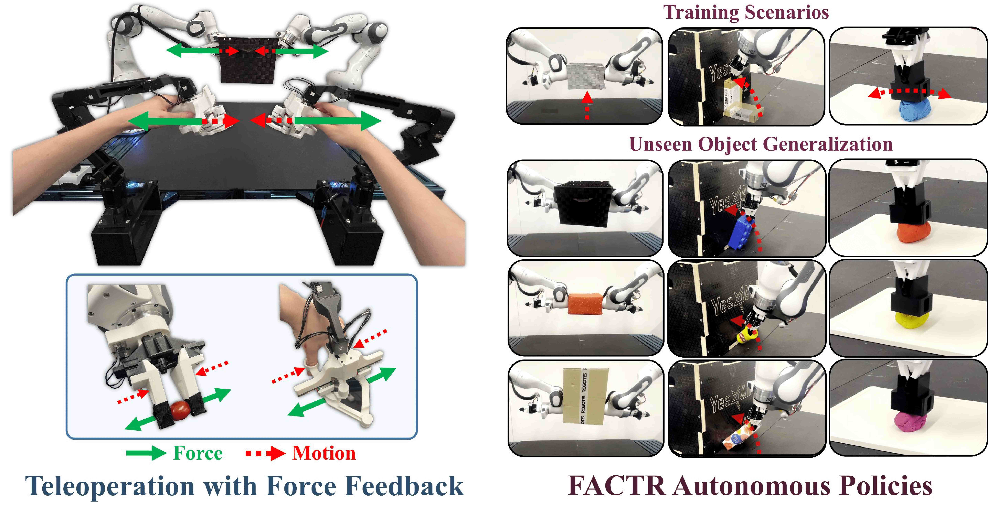

<h1> FACTR Teleop: Low-Cost Force-Feedback Teleoperation</h1>


#### [Jason Jingzhou Liu](https://jasonjzliu.com)<sup>\*</sup>, [Yulong Li](https://yulongli42.github.io)<sup>\*</sup>, [Kenneth Shaw](https://kennyshaw.net), [Tony Tao](https://tony-tao.com), [Ruslan Salakhutdinov](https://www.cs.cmu.edu/~rsalakhu/), [Deepak Pathak](https://www.cs.cmu.edu/~dpathak/)
_Carnegie Mellon University_

[Project Page](https://jasonjzliu.com/factr/) | [arXiV](https://arxiv.org/abs/2502.17432) | [FACTR](https://github.com/RaindragonD/factr/) | [FACTR Hardware](https://github.com/JasonJZLiu/FACTR_Hardware)

<h1> </h1>


<br>

## Catalog
- [Installation](#installation)
- [FACTR Teleop](#factr-teleop)
- [Data Collection](#data-collection)
- [Training and Deployment](#training-and-deployment)
- [License and Acknowledgements](#license-and-acknowledgements)
- [Citation](#citation)


## Installation

This repository requires **ROS 2**.
If you have not installed ROS 2 yet, follow the official [ROS 2 installation guide](https://docs.ros.org/en/humble/Tutorials/Beginner-Client-Libraries/Creating-A-Workspace/Creating-A-Workspace.html).

### Provided ROS 2 Packages

The following ROS 2 packages are included in this repository:

- `factr_teleop`
- `bc`
- `cameras`
- `python_utils`

These packages are located in:

```
<repo_root>/src
```

### ROS 2 Workspace Setup

These packages must reside within a **ROS 2 workspace**. If you do not already have one, create a workspace by following the [ROS 2 workspace tutorial](https://docs.ros.org/en/humble/Tutorials/Beginner-Client-Libraries/Creating-A-Workspace/Creating-A-Workspace.html).

Then:

1. Copy the four provided packages into your workspace's `src/` directory.
2. Ensure to source the ROS2 setup script in your terminal
   ```bash
   source /opt/ros/<ROS-Distribution>/setup.bash
   ```
   Note that this command should be run everytime you open a new terminal.
3. From the root of your workspace, build the workspace via:
   ```bash
   colcon build --symlink-install
   ```
   This should create the following folders in your workspace root
   ```bash
   build  install  log  src
   ```
4. From the root of your workspace, source the overlay via
   ```bash
   source install/local_setup.bash
   ```
   Note that this command should also be run everytime you open a new terminal.

> For more guidance, refer to the [ROS 2 Tutorial](https://docs.ros.org/en/humble/Tutorials/Beginner-Client-Libraries/Creating-A-Workspace/Creating-A-Workspace.html).

### Additional Python Dependencies

Install [ZMQ](https://zeromq.org/):

```bash
pip install zmq
```
Install [Pinocchio](https://stack-of-tasks.github.io/pinocchio/):
```bash
sudo apt install ros-<ROS-Distribution>-pinocchio
```
- For example,
   ```bash
   sudo apt install ros-humble-pinocchio
   ```
Alternatively, try the following via pip.
```bash
python -m pip install pin
```

Finally, navigate to the Dynamixel submodule and install it via:
```bash
cd <repo_root>/src/factr_teleop/factr_teleop/dynamixel
pip install -e python
```

Before starting the Dev Container connect the power hub boards with your PC and check if you find them:


Inside the container
Either start bash script to start all processes with 
```bash
bash launch/start_real_robot_teleop.sh
```

for switching terminal open second terminal and type
```bash
sw-hw #for switching to factr:hardware
sw-br #for switching to factr:bridge
```

or start with individual commands:

```bash
source /opt/ros/humble/setup.bash
source /factr/install/setup.bash
```

```bash
ros2 launch franka_bringup franka.launch.py robot_ip:=franka
```
or
```bash
ros2 launch launch/franka_dual_arm.launch.py     left_robot_ip:=<left_ip> right_robot_ip:=<right_ip>
```

```bash
ros2 run controller_manager spawner joint_trajectory_controller
```

```bash
python launch/franka_ros2_follower.py --name left
```

move to home position
```bash
ros2 launch franka_bringup move_to_start_example_controller.launch.py robot_ip:=franka
```

move to specific position via franka_ros2_follower.py bridge (If it runs your setup is installed correctly)
```bash
ros2 topic pub --once /joint_trajectory_controller/joint_trajectory trajectory_msgs/msg/JointTrajectory "{joint_names: [panda_joint1, panda_joint2, panda_joint3, panda_joint4, panda_joint5, panda_joint6, panda_joint7], points: [{positions: [0, 0, 0, -1.57, 0, 1.57, 0.77316529], time_from_start: {sec: 4, nanosec: 0}}]}"
```

## FACTR Teleop

When using Simulation instead of real robot setup, run the following to start the simulation:
```bash
python launch/mujoco_sim.py --initial_arm_qpos 0 0 0 -1.57 0 1.57 0 --initial_gripper_cmd 0.8
```

Then launch the teleoperation function with ROS2
```bash
ros2 launch launch/factr_teleop.py
```

## Troubleshooting
Increasing the thresholds with franka_ros2 v0.1.0 is not directly possible. Adjusting the force thresholds is possible by setting it directly in the robot.cpp file:
Then launch the teleoperation function with ROS2
```bash
src/franka_ros2/franka_hardware/src/robot.cpp
```

Then setting it via
```bash
Robot::Robot(const std::string& robot_ip, const rclcpp::Logger& logger) {
  tau_command_.fill(0.);
  franka::RealtimeConfig rt_config = franka::RealtimeConfig::kEnforce;
  if (!franka::hasRealtimeKernel()) {
    rt_config = franka::RealtimeConfig::kIgnore;
    RCLCPP_WARN(logger, "You are not using a real-time kernel...");
  }
  robot_ = std::make_unique<franka::Robot>(robot_ip, rt_config);

  // Added: raise collision/reflex thresholds from libfranka's conservative
  // defaults, matching our teleop workload (see franka_control_node.yaml).
  robot_->setCollisionBehavior(
      {{80, 80, 80, 80, 30, 30, 30}},    // lower_torque_thresholds_acceleration
      {{80, 80, 80, 80, 30, 30, 30}},    // upper_torque_thresholds_acceleration
      {{25, 25, 22, 20, 19, 17, 14}},    // lower_torque_thresholds_nominal
      {{100, 100, 100, 100, 100, 100, 100}}, // upper_torque_thresholds_nominal
      {{80, 80, 80, 30, 30, 30}},        // lower_force_thresholds_acceleration
      {{80, 80, 80, 30, 30, 30}},        // upper_force_thresholds_acceleration
      {{100, 100, 100, 100, 100, 100}},  // lower_force_thresholds_nominal
      {{100, 100, 100, 100, 100, 100}}); // upper_force_thresholds_nominal

  model_ = std::make_unique<franka::Model>(robot_->loadModel());
  franka_hardware_model_ = std::make_unique<Model>(model_.get());
}
```

To apply this in your currently running container rebuild the package:
```bash
colcon build --packages-select franka_hardware
```


## Citation
If you find this codebase useful, feel free to cite our work!
<div style="display:flex;">
<div>

```bibtex
@article{factr,
  title={FACTR: Force-Attending Curriculum Training for Contact-Rich Policy Learning},
  author={Liu, Jason Jingzhou and Li, Yulong and Shaw, Kenneth and Tao, Tony and Salakhutdinov, Ruslan and Pathak, Deepak},
  journal={arXiv preprint arXiv:2502.17432},
  year={2025}
}
```
